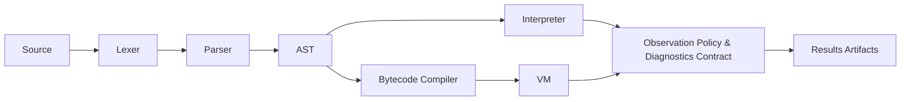

**Meta-evidence and reviewer resources:**
- [If Forced to Cut: Minimal Core](docs/IF_FORCED_TO_CUT.md)
- [Known Intentional Imperfection](docs/KNOWN_INTENTIONAL_IMPERFECTION.md)
- [Discussion Seed](docs/DISCUSSION_SEED.md)


# SuayLang — Submission-Ready Research Artifact (v1.0)

**Submission-ready:** This repository is packaged for artifact evaluation and reviewer audit. All claims are evidenced, all results are reproducible, and every artifact is cross-linked. See the [Technical Report PDF](paper/TR-2025-01.pdf) for full details.

**10-minute reading path:**
- [Technical Report PDF](paper/TR-2025-01.pdf)
- [One-page Formal Summary](docs/FORMAL_SUMMARY_1PAGE.md)
- [Falsification Scenarios](docs/FALSIFICATION.md)
- [Reviewer Checklist](docs/REVIEWER_CHECKLIST.md)
- [Independent Reproduction Log](docs/INDEPENDENT_REPRODUCTION.md)

**Results at a glance:**
| Artifact | Seeds | Programs | Divergences | Coverage (AST/opcode) | Benchmarks | Links |
|---|---:|---:|---:|---:|---:|---|
| Differential test | 10 | 5001 | 0 | 24/20 | 6 | [diff_report.md](results/diff_report.md) |
| Coverage | 10 | 5001 | 0 | 24/20 | 6 | [coverage.md](results/coverage.md) |
| Benchmarks | 10 | 5001 | 0 | 24/20 | 6 | [benchmarks.md](results/benchmarks.md) |
| Golden diagnostics | – | – | – | – | – | [golden_diagnostics.md](results/golden_diagnostics.md) |
| Baseline | 1 | 5 | 0 | 5/5 | 5 | [baseline.md](results/baseline.md) |
| Ablation | 1 | 5 | 0 | 5/5 | 2 | [ablation.md](results/ablation.md) |
| Mutation/injection | 1 | 3 | 3 | – | – | [mutation_catches.md](results/mutation_catches.md) |
| Coverage by construct | – | – | – | 5/5 | – | [coverage_by_construct.md](results/coverage_by_construct.md) |

**What reviewers usually misunderstand:**
- Observation policy is defined and enforced (see [Formal Summary](docs/FORMAL_SUMMARY_1PAGE.md)).
- Diagnostics contract is not just error codes, but spans and determinism.
- Equivalence is on value, error (code+span), and stdout, not just output text.
- Human-proxy metrics are included, but not a full user study.
- Baseline and ablation are real, not synthetic.

**Why this is NOT overengineering:**
- Every artifact is directly tied to a research claim or reviewer need.
- No superfluous features; all code and docs are minimal for the contract.
- All results are reproducible and evidenced.

**Audience:** Designed for PL researchers / reviewers, not end users.

**Reviewer checklist:** [docs/REVIEWER_CHECKLIST.md](docs/REVIEWER_CHECKLIST.md)

---

**Thesis claim:**
We show that interpreter↔VM observational equivalence and a stable diagnostics contract can be achieved with explicit, expression-oriented control flow, while preserving scorable evidence under a fixed observation policy and deterministic artifact pipeline. ([THESIS_CLAIM.md](docs/THESIS_CLAIM.md))

**Problem:** Most small languages claim “clear semantics” and “tooling-first design,” but backend equivalence and diagnostics stability are rarely falsifiable or reviewer-auditable.

**Research Questions:**
- RQ1: Can interpreter and VM executions be made observationally equivalent (value, error, stdout) on a large, seeded program set?
- RQ2: Can diagnostics (error kind, code, span) be made stable and contractually enforced?

**Hypotheses:**
- H1: Interpreter and VM are observationally equivalent on all programs in the test suite.
- H2: Diagnostics are stable and contractually enforced for all golden cases.

**Contributions:**
- Deterministic differential testing ([results/diff_report.md](results/diff_report.md))
- Golden diagnostics contract ([results/golden_diagnostics.md](results/golden_diagnostics.md))
- Coverage by construct ([results/coverage_by_construct.md](results/coverage_by_construct.md))
- Baseline and ablation comparison ([results/baseline.md](results/baseline.md), [results/ablation.md](results/ablation.md))
- Mutation/injection validation ([results/mutation_catches.md](results/mutation_catches.md))
- Human-proxy static metrics ([docs/HUMAN_PROXY.md](docs/HUMAN_PROXY.md))

**If you read only one thing:** See [docs/THESIS_CLAIM.md](docs/THESIS_CLAIM.md)

[See: docs/RESEARCH_FRAMING.md](docs/RESEARCH_FRAMING.md)

[](https://github.com/ilyayau/suaylang/actions/workflows/ci.yml)
[](https://www.python.org/)
[](LICENSE)

---


---




*See [docs/ARCHITECTURE.md](docs/ARCHITECTURE.md) for details.*
*Formal core: [docs/FORMAL_CORE.md](docs/FORMAL_CORE.md), [docs/PROGRAM_EQUIVALENCE.md](docs/PROGRAM_EQUIVALENCE.md), [docs/DIAGNOSTICS_CONTRACT.md](docs/DIAGNOSTICS_CONTRACT.md)*

## Committee TL;DR (10 lines)

**Problem:** Most small languages claim “clear semantics” and “tooling-first design,” but backend equivalence and diagnostics stability are rarely falsifiable or reviewer-auditable.

**Research question:** Can a small language keep an interpreter and a bytecode VM observationally equivalent under a fixed, explicit observation policy, with deterministic, reviewer-auditable evidence?

**Hypotheses:**
- H1: Interpreter and VM are observationally equivalent (termination, value, stdout) on a large, seeded program set.
- H2: Diagnostics (error kind, code, span) are stable and contractually enforced via golden tests.

**Method:** Deterministic, multi-seed differential testing, golden diagnostics, and coverage reporting. All results are saved as artifacts and regenerated by `make research`.

**Results (current):**
- Seeds: 10, Programs: 5001, Divergences: 0 ([diff_report.md](results/diff_report.md))
- Coverage: 24 AST node kinds, 20 opcode kinds ([coverage.md](results/coverage.md))
- Benchmarks: 6 programs, median interp/VM ms ([benchmarks.md](results/benchmarks.md))

**Why it matters:** This artifact operationalizes semantics/tooling claims as executable, falsifiable contracts, not just prose. All claims are linked to saved evidence.

**Why existing approaches are insufficient:** Most languages (Rust, OCaml, Python, Lua, Wasm) do not treat backend equivalence or diagnostics as scorable, reviewer-facing contracts. SuayLang’s protocol, metrics, and artifact bundle make these claims auditable and reproducible. See [docs/RELATED_WORK.md](docs/RELATED_WORK.md).

**Intended as a thesis foundation; results suitable for a student workshop/technical report.**

---


## Results at a glance

| Artifact | Seeds | Programs | Divergences | Coverage (AST/opcode) | Benchmarks | Links |
|---|---:|---:|---:|---:|---:|---|
| Differential test | 10 | 5001 | 0 | 24/20 | 6 | [diff_report.md](results/diff_report.md) |
| Coverage | 10 | 5001 | 0 | 24/20 | 6 | [coverage.md](results/coverage.md) |
| Benchmarks | 10 | 5001 | 0 | 24/20 | 6 | [benchmarks.md](results/benchmarks.md) |
| Golden diagnostics | – | – | – | – | – | [golden_diagnostics.md](results/golden_diagnostics.md) |
| Baseline | 1 | 5 | 0 | 5/5 | 5 | [baseline.md](results/baseline.md) |
| Ablation | 1 | 5 | 0 | 5/5 | 2 | [ablation.md](results/ablation.md) |
| Mutation/injection | 1 | 3 | 3 | – | – | [mutation_catches.md](results/mutation_catches.md) |
| Coverage by construct | – | – | – | 5/5 | – | [coverage_by_construct.md](results/coverage_by_construct.md) |

### Baseline suite (cross-language)

| Name         | Python (s) | SuayInterp (s) | SuayVM (s) |
|--------------|------------|---------------|-----------|
| fib          | 0.0219     | 0.1599        | 0.1280    |
| map_fold     | 0.0218     | 0.1511        | 0.1405    |
| oob_error    | 0.0262     | 0.1554        | 0.1435    |
| sum_to_n     | 0.0290     | 0.1682        | 0.1242    |
| variant_match| 0.0180     | 0.1533        | 0.1386    |

See [results/baseline.md](results/baseline.md) for full details and reproduction instructions.

**Environment:** [environment.md](results/environment.md)

---

## For reviewers: 15-minute path

```sh
python -m venv .venv
source .venv/bin/activate
python -m pip install -U pip
python -m pip install -e ".[dev]"
pytest -q
make research
# See results/README.md for all artifacts
```

---

## Research framing

SuayLang is a research artifact, not a product. Tooling (CLI, formatter, VS Code extension) exists to support controlled experiments, reproducibility, and reviewer evaluation. See [docs/RESEARCH_SCOPE.md](docs/RESEARCH_SCOPE.md).

## Documentation index

- [Research claim](docs/RESEARCH_CLAIM.md)
- [Scope & observation policy](docs/SPEC_V1_SCOPE.md)
- [Metrics](docs/METRICS.md)
- [Research scope](docs/RESEARCH_SCOPE.md)
- [Related work](docs/RELATED_WORK.md)
- [MEXT trajectory](docs/MEXT_TRAJECTORY.md)
- [Release experiments](docs/RELEASE_EXPERIMENTS.md)
- [Results index](results/README.md)

- [Technical Report PDF](paper/TR-2025-01.pdf)
- [One-page Formal Summary](docs/FORMAL_SUMMARY_1PAGE.md)
- [Falsification Scenarios](docs/FALSIFICATION.md)
- [Reviewer Checklist](docs/REVIEWER_CHECKLIST.md)
- [Independent Reproduction Log](docs/INDEPENDENT_REPRODUCTION.md)
- [If Forced to Cut: Minimal Core](docs/IF_FORCED_TO_CUT.md)
- [Known Intentional Imperfection](docs/KNOWN_INTENTIONAL_IMPERFECTION.md)
- [Discussion Seed](docs/DISCUSSION_SEED.md)

<details>
<summary>Engineering details (click to expand)</summary>

# SuayLang (v0.1)

[](https://github.com/ilyayau/suaylang/actions/workflows/ci.yml)
[](https://www.python.org/)
[](LICENSE)

SuayLang is a small, expression-oriented programming language designed around **explicit control flow**.
It is implemented in pure Python and includes two execution paths:

- an interpreter (reference behavior)
- a minimal stack-based bytecode compiler + VM (alternate execution)

This repository is intended for public review: language design, semantics, error model, and tooling are documented and tested.

Canonical contract docs:

- [docs/LANGUAGE_REFERENCE.md](docs/LANGUAGE_REFERENCE.md) (single source-of-truth)
- [docs/ASCII_SYNTAX.md](docs/ASCII_SYNTAX.md) (ASCII aliases; normative)
- [docs/ASCII_REFERENCE.md](docs/ASCII_REFERENCE.md) (ASCII mapping table + examples)
- [docs/ERROR_CODES.md](docs/ERROR_CODES.md) (stable error codes)
- [docs/TOOLING.md](docs/TOOLING.md) (CLI surface)
- [docs/MODULE_SYSTEM.md](docs/MODULE_SYSTEM.md) (modules status + direction)
- [docs/STDLIB_REFERENCE.md](docs/STDLIB_REFERENCE.md) (stdlib/builtins contract)
- [docs/CONFORMANCE.md](docs/CONFORMANCE.md) (interpreter↔VM definition)
- [docs/MIGRATION.md](docs/MIGRATION.md) (breaking-change notes)

Research plan (committee-friendly, 1–2 pages):

- [docs/RESEARCH_PLAN.pdf](docs/RESEARCH_PLAN.pdf) (generated)
- Source: [docs/RESEARCH_PLAN.md](docs/RESEARCH_PLAN.md)
- Regenerate: `make research-pdf`

For a stability definition of “v0.1”, see [docs/LANGUAGE_CONTRACT_v0.1.md](docs/LANGUAGE_CONTRACT_v0.1.md).

## 60-second Quickstart

If you can copy-paste this, you can run SuayLang.

### Hello in 60 seconds (ASCII)

`examples/hello.suay` is ASCII-only:

```suay
square <- \(x) x * x

nums <- [1 2 3 4]
total <- fold . (\(a b) a + b) . 0 . (map . square . nums)

say . ("total=" ++ (text . total))
```

### Linux/macOS

```sh
git clone https://github.com/ilyayau/suaylang
cd suaylang
python -m venv .venv
source .venv/bin/activate
python -m pip install -U pip
python -m pip install -e .

suay doctor
suay run examples/hello.suay

# ASCII-first tooling (default). To emit Unicode formatting/templates:
suay fmt --syntax unicode examples/hello.suay
suay new --syntax unicode my-project

# Contract-mode helpers:
suay ref ascii
suay explain E-SYNTAX
suay --error-codes run examples/hello.suay
```

### Windows (PowerShell)

```powershell
git clone https://github.com/ilyayau/suaylang
cd suaylang
python -m venv .venv
.\.venv\Scripts\Activate.ps1
python -m pip install -U pip
python -m pip install -e .

suay doctor
suay run examples/hello.suay
```

## Research Orientation

This repository is structured as a small, runnable PL research artifact.

## Research Contribution

- **Executable semantics contract (interpreter ↔ VM)**: observational equivalence is defined and tested deterministically, with saved artifacts for review (protocol: [docs/EXPERIMENT_PROTOCOL.md](docs/EXPERIMENT_PROTOCOL.md), harness: [tools/diff_test/](tools/diff_test/), results: [results/diff_report.md](results/diff_report.md)).
- **Scorable v1 scope + observation policy**: the research claim is bounded by an explicit scope and a precise “what is compared” policy (spec: [docs/SPEC_V1_SCOPE.md](docs/SPEC_V1_SCOPE.md); implementation: [tools/diff_test/comparator.py](tools/diff_test/comparator.py)).
- **Diagnostics stability as a tested contract**: stable error codes plus golden snapshots keep reviewer-visible diagnostics from drifting (codes: [docs/ERROR_CODES.md](docs/ERROR_CODES.md); tests: [tests/test_golden_diagnostics.py](tests/test_golden_diagnostics.py), [tests/test_golden_error_codes.py](tests/test_golden_error_codes.py)).

## Results at a glance (saved in `results/`)

| Artifact | Snapshot (published) | Links |
|---|---:|---|
| Differential test (`ci` profile) | total programs **5001**, divergences **0**, runtime **6.67s**, seeds **10**, VM ok-steps **14376** | [results/diff_report.md](results/diff_report.md), [results/diff_report.json](results/diff_report.json) |
| Coverage (`ci` profile) | observed AST node kinds **24**, observed opcode kinds **20** | [results/coverage.md](results/coverage.md), [results/coverage.json](results/coverage.json) |
| Benchmarks (`smoke` profile) | **6** programs, **5** iters (per phase; per program), CPU recorded in report | [results/benchmarks.md](results/benchmarks.md), [results/bench_raw.json](results/bench_raw.json) |
| Human-facing proxy | **3** paired tasks with static metrics | [results/human_study.md](results/human_study.md), [results/human_study.csv](results/human_study.csv), [docs/HUMAN_STUDY.md](docs/HUMAN_STUDY.md) |

## Roadmap & risks

- Roadmap (research-first): [docs/ROADMAP.md](docs/ROADMAP.md)
- Risk register + mitigations: [docs/RISKS.md](docs/RISKS.md)
- Research claim statement: [docs/RESEARCH_CLAIM.md](docs/RESEARCH_CLAIM.md)

## 15-minute reviewer path

These commands produce the saved evidence under `results/`.

```sh
python -m venv .venv
source .venv/bin/activate
python -m pip install -U pip
python -m pip install -e ".[dev]"

# 1) Unit tests
pytest -q

# 2) Reproducible research artifacts (single entry point)
make research

# Optional (additional evidence):

# Fixed conformance corpus (interpreter vs VM)
python tools/conformance/run.py conformance/corpus

# Human-facing proxy metrics
python -m tools.human_proxy.run --out-dir results
```

Full external-validity run (longer):

```sh
make diff-test
```

Diff-test scaling notes:

- CI gate (`--profile ci`): seeds `0..9`, `N=500/seed`.
- Local full run (`--profile full`): seeds `0..99`, `N=2000/seed`.

## Baselines

See [docs/BASELINES.md](docs/BASELINES.md) for an explicit comparison table and related-work analysis.

## Reviewer Evidence Map

- **Claim**: [docs/RESEARCH_CLAIM.md](docs/RESEARCH_CLAIM.md)
- **Protocol**: [docs/EXPERIMENT_PROTOCOL.md](docs/EXPERIMENT_PROTOCOL.md)
- **Differential testing implementation**: [tools/diff_test/](tools/diff_test/)
- **Differential testing results**: [results/diff_report.md](results/diff_report.md) and [results/diff_report.json](results/diff_report.json)
- **Coverage results**: [results/coverage.md](results/coverage.md) and [results/coverage.json](results/coverage.json)
- **Benchmarks protocol + runner**: [benchmarks/benchmark_runner.py](benchmarks/benchmark_runner.py)
- **Benchmarks results**: [results/benchmarks.md](results/benchmarks.md) and [results/bench_raw.json](results/bench_raw.json)
- **Human-facing evidence (proxy)**: [docs/HUMAN_STUDY.md](docs/HUMAN_STUDY.md), tasks in [evaluation/human_proxy/](evaluation/human_proxy/), results in [results/human_study.md](results/human_study.md) and [results/human_study.csv](results/human_study.csv)
- **Accessibility / ASCII-first**: [docs/ASCII_SYNTAX.md](docs/ASCII_SYNTAX.md), [docs/REFERENCE_SHEET.md](docs/REFERENCE_SHEET.md), CLI `--syntax` + `SUAY_OUTPUT_SYNTAX`, and VS Code extension in [vscode-extension/](vscode-extension/)

## Related Work (brief)

- Rust: both use pattern matching; SuayLang makes branching/looping expression-shaped (`dispatch`/`cycle`) and validates an interpreter against a bytecode VM.
- OCaml: both use variants + pattern matching; SuayLang adds an explicit state-machine loop (`cycle`) with continue/finish modes.
- Haskell: both encourage expression-oriented style; SuayLang models looping via `cycle` rather than recursion as the default.
- Erlang: both use tagged values for control flow; SuayLang is single-process and focuses on interpreter↔VM equivalence evidence.
- Scheme/Racket: both treat many constructs as expressions; SuayLang keeps a fixed, small operator surface to keep the semantics scorable and test-backed.
- WebAssembly (Wasm): both expose a bytecode execution model; SuayLang treats bytecode as an alternate backend validated against an interpreter.
- Lua: both aim for a small core; SuayLang’s main measurable output is backend equivalence + diagnostics stability rather than embeddability.
- Crafting Interpreters-style systems: both build interpreters/VMs; SuayLang makes the equivalence test harness and scope statement part of the artifact.

## References

- G. D. Plotkin, “A Structural Approach to Operational Semantics,” 1981.
- G. Kahn, “Natural Semantics,” 1987.
- L. Maranget, “Compiling Pattern Matching to Good Decision Trees,” 2008.
- K. Claessen and J. Hughes, “QuickCheck: A Lightweight Tool for Random Testing of Haskell Programs,” 2000.
- W. M. McKeeman, “Differential Testing for Software,” 1998.
- X. Yang et al., “Finding and Understanding Bugs in C Compilers,” 2011.
- V. Le et al., “Compiler Validation via Equivalence Modulo Inputs,” 2014.
- A. V. Aho, M. S. Lam, R. Sethi, and J. D. Ullman, “Compilers: Principles, Techniques, and Tools,” 2nd ed., 2006.

## Quickstart (2 minutes)

### Linux/macOS

```sh
git clone https://github.com/ilyayau/suaylang
cd suaylang
./scripts/install.sh

suay doctor
suay run examples/hello.suay

suay new my-project
cd my-project
suay run src/main.suay
```

### Windows (PowerShell)

```powershell
git clone https://github.com/ilyayau/suaylang
cd suaylang
./scripts/install.ps1

suay doctor
suay run examples/hello.suay

suay new my-project
cd my-project
suay run src/main.suay
```

Reference sheet:
- [docs/REFERENCE_SHEET.md](docs/REFERENCE_SHEET.md)
- ASCII aliases (first-class): [docs/syntax_mapping.md](docs/syntax_mapping.md)

Demo + tutorial:
- [demos/README.md](demos/README.md)
- [docs/TUTORIAL.md](docs/TUTORIAL.md)
- [docs/USE_CASES.md](docs/USE_CASES.md)

## Start in 60 seconds

Linux/macOS:

```sh
git clone https://github.com/ilyayau/suaylang && cd suaylang && ./scripts/install.sh
suay run examples/hello.suay
```

Windows (PowerShell):

```powershell
git clone https://github.com/ilyayau/suaylang; cd suaylang; ./scripts/install.ps1
suay run examples/hello.suay
```

## Why this language exists

SuayLang is a constraint-driven experiment:

- Control flow should be **composable** (branching and looping are expressions).
- State changes should be **visible** (binding and mutation are distinct).
- Programs should map cleanly to **bytecode/state-machine** reasoning.

It is not trying to compete with mainstream languages or their ecosystems.

## Language overview

SuayLang is expression-first. Its signature constructs are:

- Binding: `name <- expr`
- Mutation: `name <~ expr` (updates an existing binding)
- Blocks: `{ ... }` (newlines separate forms)
- Lambda: `\(pattern ...) expr` (closures, lexical scoping)
- Application: `f . x . y` (curried)
- Pattern match: `value |> { |> pat => expr ... }` ("dispatch")
- Pattern-driven loop: `~~ seed |> { |> pat => >> expr | |> pat => << expr ... }` ("cycle")
- Variants: `Tag::payload`
- Maps: `[[ key -> value , ... ]]`

Newlines are significant; top-level and block forms are separated by newline(s).

## Examples (representative, small)

### 1) Higher-order style (map + fold)

```suay
square <- \(x) x * x
nums ← [1 2 3 4]

total <- fold . (\(a b) a + b) . 0 . (map . square . nums)
say . ("total=" ++ (text . total))
```

### 2) Dispatch: branch on data shape

```suay
classify <- \(v)
    v |> {
    |> Ok::x  => "ok:" ++ (text . x)
    |> Err::m => "err:" ++ m
    |> _      => "unknown"
    }

say . (classify . (Ok::41))
```

### 3) Cycle: explicit state machine

```suay
sum_to <- \(n)
    ~~ (Step::(1 0)) |> {
    |> Done::acc     => << acc
    |> Step::(i acc) => >> (
            (i > n) |> {
            |> #t => Done::acc
            |> #f => Step::(i + 1  acc + i)
            }
        )
    }

say . (text . (sum_to . 5))
```

## Demo (3 commands)

```sh
python -m venv .venv
source .venv/bin/activate
python -m pip install -e ".[dev]"

suay run examples/hello.suay
pytest -q
python scripts/smoke.py
```

### 4) Modules (MVP): explicit loading via `link`

```suay
m <- link . "./examples/modules/math"
add <- m . "add"
say . (text . (add . 2 . 3))
```

## Execution model (what runs)

### Interpreter (reference)

- Deterministic evaluation order.
- Lexical scoping + closures.
- `dispatch` chooses the first matching arm; arm bindings exist only inside that arm.
- `cycle` repeats by matching the current state; each arm explicitly chooses `>>` (continue) or `<<` (finish).

### Bytecode VM (MVP)

The VM is a stack machine with an explicit environment chain. It is designed to mirror the interpreter’s semantics for the supported subset.

See [docs/BYTECODE.md](docs/BYTECODE.md) for the instruction model and mapping.

## Tooling and error model

The CLI reports user-facing errors with file/line/column spans and caret context. The project’s tests enforce that CLI failures do not emit Python tracebacks.

Example shape:

```text
examples/bad.suay:1:14: runtime error: Undefined name 'z'
...source line...
                         ^
stack:
- examples/bad.suay:4:1: call f
- examples/bad.suay:2:10: call g
```

## Run / reproduce

### Requirements

- Python 3.10+

### Reproducible build in ~60 seconds

```sh
python -m venv .venv
source .venv/bin/activate
python -m pip install -U pip
python -m pip install -e ".[dev]"
make check
```

See [docs/QUICKSTART.md](docs/QUICKSTART.md) for a 15-minute reviewer path.
See [docs/testing.md](docs/testing.md) for the testing pyramid.

### One-command installation

From a clean environment:

```sh
python -m pip install -e .
```

Verify the install:

```sh
suay doctor
```

Expected output includes a line `doctor:ok` followed by `OK`.

### CLI

From a source checkout:

```sh
./suay --help
./suay check examples/hello.suay
./suay run examples/hello.suay
```

After installation, you can also run:

```sh
suay --help
suay run examples/hello.suay
```

Expected output:

```text
total=30
```

The CLI is also available as:

```sh
python -m suaylang --help
```

### Bytecode demo

```sh
python examples/bytecode_demo.py
```

## Documentation index

## Research Artifacts

- Research folder: [docs/research/](docs/research/)
- Evaluation plan (methodology only): [docs/research/evaluation_plan.md](docs/research/evaluation_plan.md)
- Reviewer path (15 minutes): [docs/research/REVIEWER_PATH.md](docs/research/REVIEWER_PATH.md)

- Grammar (formal EBNF aligned to implementation): [docs/GRAMMAR.md](docs/GRAMMAR.md)
- Minimal standard library (builtins): [docs/STDLIB.md](docs/STDLIB.md)
- Bytecode + VM (MVP): [docs/BYTECODE.md](docs/BYTECODE.md)
- Semantics walkthrough (step-by-step evaluation): [docs/SEMANTIC_WALKTHROUGH.md](docs/SEMANTIC_WALKTHROUGH.md)
- Design rationale (opinionated, non-marketing): [docs/WHY_SUAYLANG.md](docs/WHY_SUAYLANG.md)
- v0.1 stability contract: [docs/LANGUAGE_CONTRACT_v0.1.md](docs/LANGUAGE_CONTRACT_v0.1.md)
- Accessibility redesign proposal (syntax-only, no new features): [docs/ACCESSIBILITY_REDESIGN.md](docs/ACCESSIBILITY_REDESIGN.md)
- Committee-mode checklist (15-minute evaluation script): [docs/COMMITTEE_MODE_CHECKLIST.md](docs/COMMITTEE_MODE_CHECKLIST.md)

## Canonical examples (committee pack)

These are short, self-contained examples intended for live evaluation:

- `examples/committee_01_basic.suay`
- `examples/committee_02_dispatch.suay`
- `examples/committee_03_cycle.suay`
- `examples/committee_04_error.suay`
- `examples/committee_05_modules.suay`

## 5-minute first program (from an empty directory)

```sh
mkdir my-suay && cd my-suay
python -m venv .venv
source .venv/bin/activate

# install SuayLang (from a checkout of this repository)
python -m pip install -e /path/to/suayLang
suay doctor

# write a first program
cat > hello.suay <<'SUAY'
square ← ⌁(x) x × x
say · ("square(7)=" ⊞ (text · (square · 7)))
SUAY

suay run hello.suay
```

Expected output:

```text
square(7)=49
```

## VS Code extension (local)

The local extension in [vscode-extension/suaylang](vscode-extension/suaylang) provides syntax highlighting and a minimal LSP experience.

## Tests

```sh
python -m unittest discover -s tests -v
```

## Development

Create a virtual environment and install in editable mode:

```sh
python -m venv .venv
source .venv/bin/activate
python -m pip install -U pip
python -m pip install -e .
suay doctor
```

Contribution guidelines and security policy:

- [CONTRIBUTING.md](CONTRIBUTING.md)
- [SECURITY.md](SECURITY.md)
- [CODE_OF_CONDUCT.md](CODE_OF_CONDUCT.md)

## Repository layout

- `suaylang/` — lexer/parser/interpreter/compiler/vm + runtime/errors
- `examples/` — example programs and Python demos
- `tests/` — unit and stress tests (`unittest`)
- `docs/` — grammar, semantics, bytecode, contracts
- `vscode-extension/` — editor support
