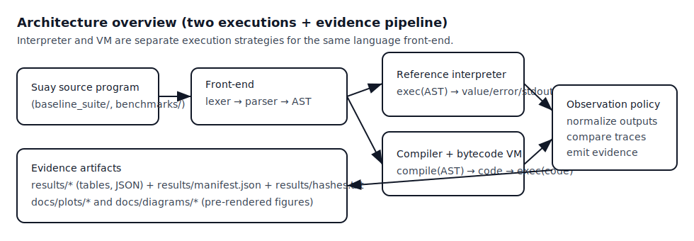
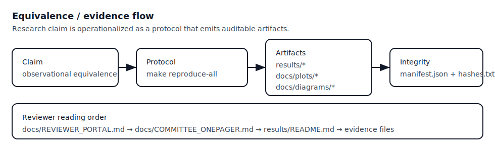

# SuayLang (Suay Language): Research Artifact for MEXT Review

**Scientific contribution (1–3 sentences):** SuayLang packages an interpreter/VM pair as an auditable research artifact by making (i) the observation policy explicit, (ii) the claim→artifact→command mapping first-class, and (iii) integrity metadata (hashes) reproducible. The contribution is methodological: how to evaluate and communicate backend equivalence as a committee-reviewable artifact.

## Research question

**RQ:** Can two independent executions (reference interpreter and bytecode VM) be made observationally equivalent under a fixed observation policy, and evaluated via a deterministic, file-based evidence pipeline?

**Hypothesis:** For the supported subset and corpora, interpreter and VM executions are observationally equivalent in observed value/error/stdout under docs/OBSERVATION_POLICY.md.

## Novelty (relative to typical language demos)

- Explicit observation policy as a normative contract (what is compared, what is excluded, how to falsify).
- Committee-oriented evidence pipeline: claim→artifact→command mapping plus an artifact index under results/.
- Integrity metadata: generated hashes (results/hashes.txt) to support independent reproduction receipts.

**Main research claim (1 sentence):** **SuayLang provides two independent executions (reference interpreter and bytecode VM) and a reproducible protocol to test observational equivalence under an explicit observation policy.**

Ultra TL;DR (30 seconds):
- What: a small language + two runtimes (interpreter, VM) + evidence pipeline.
- Why: engineering-style cross-checking as a research method (two implementations, one spec).
- Evidence is file-based: every claim links to a concrete artifact under results/.
- Reproduce (canonical): `make reproduce-all` (or `bash ./scripts/reproduce.sh` for the scripted path).
- If results diverge, see: docs/REPRODUCIBILITY.md ("If results diverge" section).

Evidence map (click → file → command):
- 30 seconds: this page (claim + command + evidence map)
- 7 minutes: [docs/REVIEWER_PORTAL.md](docs/REVIEWER_PORTAL.md) → [docs/COMMITTEE_ONEPAGER.md](docs/COMMITTEE_ONEPAGER.md) → [results/README.md](results/README.md)
- 15 minutes: [docs/TECHREPORT.md](docs/TECHREPORT.md) + [docs/THREATS_TO_VALIDITY.md](docs/THREATS_TO_VALIDITY.md) + [docs/LIMITATIONS.md](docs/LIMITATIONS.md)
- Claim↔evidence table: [docs/CLAIM_EVIDENCE_MATRIX.md](docs/CLAIM_EVIDENCE_MATRIX.md)

Quickstart (≤8 lines):
```sh
python3.12 -m venv .venv && . .venv/bin/activate
python -m pip install -U pip
python -m pip install -e ".[dev]"
make reproduce-all
ls -la results/
```

Diagrams (pre-rendered SVG; no Mermaid dependency):





Primary artifacts (index + hashes):

| Claim surface | Where to look | What you should see | Reproduce |
|---|---|---|---|
| Equivalence protocol | results/README.md | an artifact index + generation receipt | `make reproduce-all` |
| Baseline suite timings | results/baseline.md | table regenerated on your machine | `make baseline` |
| Microbench example + plot | benchmarks/results.md and docs/plots/microbench_relative.png | "example run" table + a relative plot | `make plot-microbench` |
| Artifact hashes | results/manifest.json and results/hashes.txt | SHA-256 per artifact | `make hashes` |

If you only read one page: docs/COMMITTEE_ONEPAGER.md

Entry hub for reviewers: [docs/REVIEWER_PORTAL.md](docs/REVIEWER_PORTAL.md)

## Related work (links)

This section is intentionally lightweight; BibTeX entries live in citations.bib.

- Differential testing and compiler validation (Csmith): https://github.com/csmith-project/csmith
- QuickCheck / property-based testing: https://dl.acm.org/doi/10.1145/357766.351266
- Mutation testing survey: https://dl.acm.org/doi/10.1145/2001420.2001446
- SIGPLAN artifact evaluation practices: https://www.sigplan.org/Resources/ArtifactEvaluation/
- Reproducible builds: https://reproducible-builds.org/
- Software citation format (CITATION.cff): https://citation-file-format.github.io/
- Zenodo DOI minting for GitHub releases: https://zenodo.org/

## How to cite

- CITATION metadata: CITATION.cff
- BibTeX: citations.bib

## Paper and publication

- Draft paper (in-repo): paper.md
- Preprint status (no external upload is claimed): docs/PREPRINT_STATUS.md
- Publication plan: docs/PUBLICATION_PLAN.md
- Expected academic outcomes: docs/EXPECTED_OUTCOMES.md
