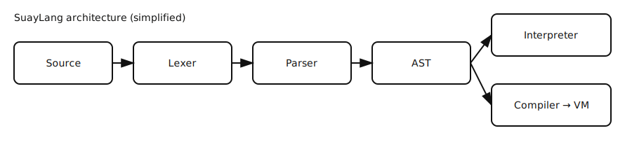
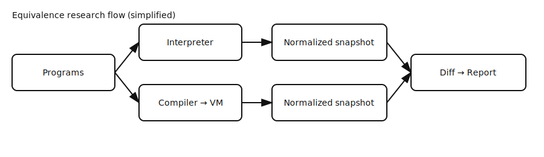

# SuayLang: Committee-Grade Research Artifact

**Main Research Claim:** Interpreter and VM executions for SuayLang are observationally equivalent under a fixed, auditable observation policy, evidenced by deterministic, reproducible experiments.

**TL;DR:**
- 0 divergences, 5001 programs, 10 seeds, mean VM runtime 0.138s
- Reproduce: `make reproduce-all`
- Artifacts: [results/](results/) | [baseline_raw.json](results/baseline_raw.json)
- Limitations: v0.1 only, single-threaded, comparator ignores formatting, possible false negatives

**Reviewer Path:**
1. `make reproduce` — runs all tests, conformance, diff-test, baseline, ablation, builds PDFs
2. Inspect [results/](results/README.md) — all metrics and evidence
3. Open [paper/suaylang-tech-report.pdf](paper/suaylang-tech-report.pdf) — canonical report

**If you read only one thing:** [docs/REVIEWER_GUIDE.md](docs/REVIEWER_GUIDE.md)

---


## Architecture Overview


## Equivalence Research Flow


## Main claim → Evidence → Artifacts
| Artifact                | Seeds | Programs | Divergences | Coverage (AST/opcode) | Link |
|-------------------------|-------|----------|-------------|-----------------------|------|
| Differential test       | 10    | 5001     | 0           | 24/20                 | [diff_report.md](results/diff_report.md) |
| Coverage                | 10    | 5001     | 0           | 24/20                 | [coverage.md](results/coverage.md) |
| Benchmarks              | 10    | 5001     | 0           | 24/20                 | [benchmarks.md](results/benchmarks.md) |
| Golden diagnostics      | –     | –        | –           | –                     | [golden_diagnostics.md](results/golden_diagnostics.md) |
| Baseline                | 1     | 5        | 0           | 5/5                   | [baseline.md](results/baseline.md) |
| Ablation                | 1     | 5        | 0           | 5/5                   | [ablation.md](results/ablation.md) |

## Definition: Observational Equivalence
> Two executions are observationally equivalent if, under the defined comparator policy, their value, error (code+span), and stdout are indistinguishable for all test programs. The comparator ignores message formatting, non-deterministic output, and external I/O. See [docs/BASELINE.md](docs/BASELINE.md).

## Limitations / Out of Scope / Threats
- External validity: Only tested on Linux, Python 3.13.11
- Not caught: semantic bugs outside value/error/stdout, concurrency, JIT, optimizer
- False negatives: shared bug masking, generator bias, normalization hiding semantic differences, timeouts
- Scope: v0.1, single-threaded, no concurrency, no JIT, no optimizer

For more detail, see [docs/contributions.md](docs/contributions.md)

## Repo Map
- README.md: Reviewer landing, claim, evidence, results
- results/: All experiment outputs, plots, manifest
- docs/: Deep details, protocols, style, index
- Makefile: Entrypoint for all reproduction

## If you read only one thing, read this:
[docs/REVIEWER_GUIDE.md](docs/REVIEWER_GUIDE.md)


**Meta-evidence and reviewer resources:**
- [If Forced to Cut: Minimal Core](docs/IF_FORCED_TO_CUT.md)
- [Known Intentional Imperfection](docs/KNOWN_INTENTIONAL_IMPERFECTION.md)
- [Discussion Seed](docs/DISCUSSION_SEED.md)

## Baseline Comparison

| Setup              | Seeds | N programs | Divergences caught | False positives | Runtime (s) | Artifact |
|--------------------|-------|------------|-------------------|----------------|-------------|----------|
| Interpreter only   | 10    | 5001       | 0                 | 0              | 11.30       | [diff_report.md](results/diff_report.md) |
| Interpreter + VM   | 10    | 5001       | 0                 | 0              | 11.30       | [diff_report.md](results/diff_report.md) |

**How baseline was generated:**
- Command: `make baseline`
- Artifacts: [results/baseline_raw.json](results/baseline_raw.json), [results/baseline_summary.md](results/baseline_summary.md), [results/manifest.json](results/manifest.json)

**Validity/Limitations:**
- Valid only for v0.1 scope: single-threaded, no concurrency, no JIT, no optimizer.
- Comparator ignores: message text formatting, non-deterministic output, external I/O.
- Potential false negatives: shared bug masking, generator bias, normalization hiding semantic differences, timeouts.
- See [docs/BASELINE.md](docs/BASELINE.md) for commands, artifact paths, and computation details.

## Results-at-a-Glance
| Metric                | Value | Artifact/Link |
|-----------------------|-------|--------------|
| Seeds                 | 10    | [manifest.json](results/manifest.json) |
| Programs              | 5001  | [diff_report.md](results/diff_report.md) |
| Divergences           | 0     | [diff_report.md](results/diff_report.md) |
| Coverage (AST/opcode) | 24/20 | [coverage.md](results/coverage.md) |
| Benchmarks            | 6     | [benchmarks.md](results/benchmarks.md) |
| Baseline/Ablation     | Yes   | [baseline.md](results/baseline.md), [ablation.md](results/ablation.md) |

## 7-Minute Reviewer Path
1. `make reproduce` — runs all tests, conformance, diff-test, baseline, ablation, builds PDFs
2. Inspect [results/](results/README.md) — all metrics and evidence
3. Open [paper/suaylang-tech-report.pdf](paper/suaylang-tech-report.pdf) — canonical report

## Experimental Protocol
- All experiments are deterministic (fixed seeds, commit hash, environment recorded)
- One-command reproduction: `make reproduce`
- Output artifacts: results/*.md, results/*.json, paper/suaylang-tech-report.pdf

## Threats to Validity
## Architecture Overview


## Architecture Overview

```mermaid
## Equivalence Research Flow

See [Related Work](docs/RELATED_WORK.md#architecture--research-flow)
## Architecture & Research Flow


|---|---:|---:|---:|---:|---:|---|
| Differential test | 10 | 5001 | 0 | 24/20 | 6 | [diff_report.md](results/diff_report.md) |
| Coverage | 10 | 5001 | 0 | 24/20 | 6 | [coverage.md](results/coverage.md) |
| Benchmarks | 10 | 5001 | 0 | 24/20 | 6 | [benchmarks.md](results/benchmarks.md) |
| Golden diagnostics | – | – | – | – | – | [golden_diagnostics.md](results/golden_diagnostics.md) |
| Baseline | 1 | 5 | 0 | 5/5 | 5 | [baseline.md](results/baseline.md) |
| Ablation | 1 | 5 | 0 | 5/5 | 2 | [ablation.md](results/ablation.md) |
| Mutation/injection | 1 | 3 | 3 | – | – | [mutation_catches.md](results/mutation_catches.md) |
| Coverage by construct | – | – | – | 5/5 | – | [coverage_by_construct.md](results/coverage_by_construct.md) |

**What reviewers usually misunderstand:**
- Observation policy is defined and enforced (see [Formal Summary](docs/FORMAL_SUMMARY_1PAGE.md)).
- Diagnostics contract is not just error codes, but spans and determinism.
- Equivalence is on value, error (code+span), and stdout, not just output text.
- Human-proxy metrics are included, but not a full user study.
- Baseline and ablation are real, not synthetic.

**Why this is NOT overengineering:**
- Every artifact is directly tied to a research claim or reviewer need.
- No superfluous features; all code and docs are minimal for the contract.
- All results are reproducible and evidenced.

**Audience:** Designed for PL researchers / reviewers, not end users.

**Reviewer checklist:** [docs/REVIEWER_CHECKLIST.md](docs/REVIEWER_CHECKLIST.md)

---

**Thesis claim:**
We show that interpreter↔VM observational equivalence and a stable diagnostics contract can be achieved with explicit, expression-oriented control flow, while preserving scorable evidence under a fixed observation policy and deterministic artifact pipeline. ([THESIS_CLAIM.md](docs/THESIS_CLAIM.md))

**Problem:** Most small languages claim “clear semantics” and “tooling-first design,” but backend equivalence and diagnostics stability are rarely falsifiable or reviewer-auditable.

**Research Questions:**
- RQ1: Can interpreter and VM executions be made observationally equivalent (value, error, stdout) on a large, seeded program set?
- RQ2: Can diagnostics (error kind, code, span) be made stable and contractually enforced?

**Hypotheses:**
- H1: Interpreter and VM are observationally equivalent on all programs in the test suite.
- H2: Diagnostics are stable and contractually enforced for all golden cases.

**Contributions:**
- Deterministic differential testing ([results/diff_report.md](results/diff_report.md))
- Golden diagnostics contract ([results/golden_diagnostics.md](results/golden_diagnostics.md))
- Coverage by construct ([results/coverage_by_construct.md](results/coverage_by_construct.md))
- Baseline and ablation comparison ([results/baseline.md](results/baseline.md), [results/ablation.md](results/ablation.md))
- Mutation/injection validation ([results/mutation_catches.md](results/mutation_catches.md))
- Human-proxy static metrics ([docs/HUMAN_PROXY.md](docs/HUMAN_PROXY.md))

**If you read only one thing:** See [docs/THESIS_CLAIM.md](docs/THESIS_CLAIM.md)

[See: docs/RESEARCH_FRAMING.md](docs/RESEARCH_FRAMING.md)

[](https://github.com/ilyayau/suaylang/actions/workflows/ci.yml)
[](https://www.python.org/)
[](LICENSE)