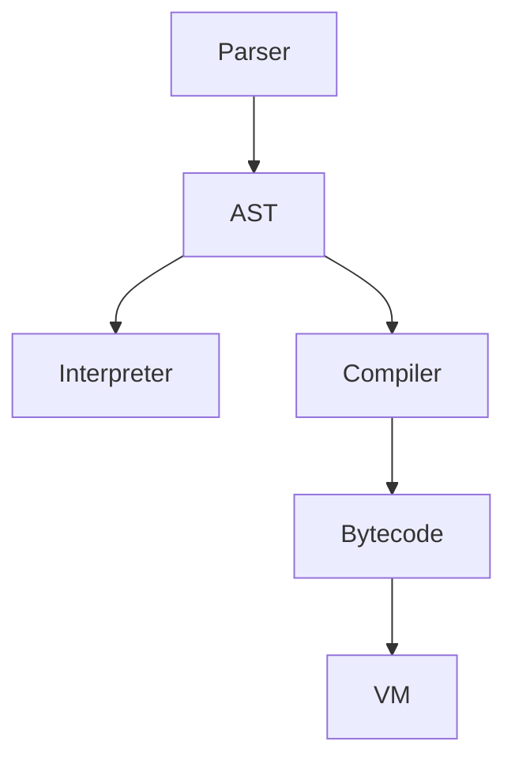
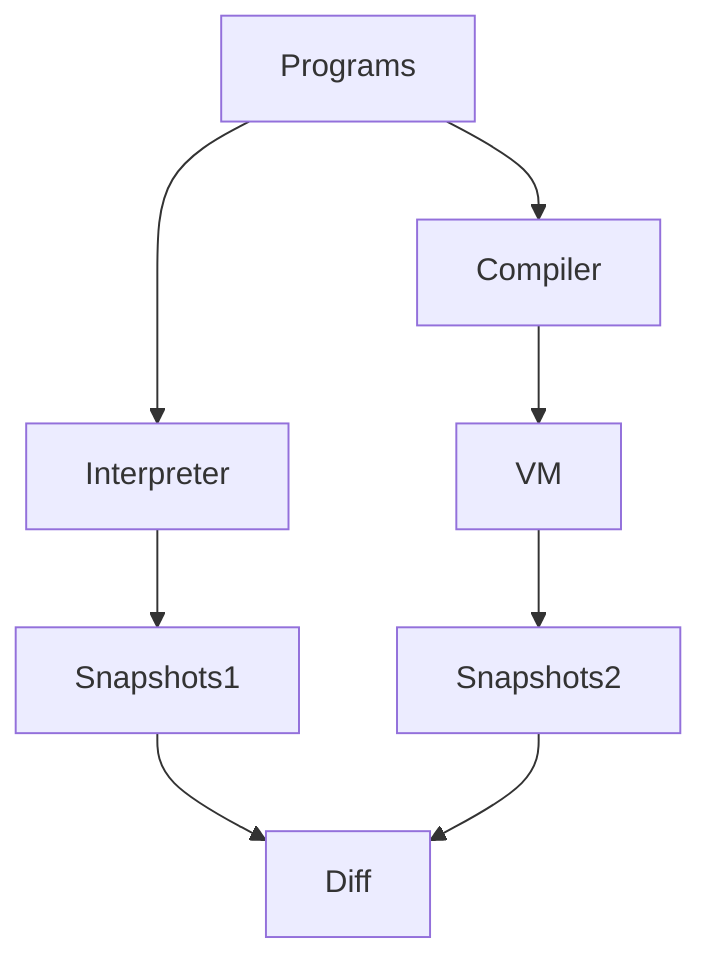

# SuayLang: Committee-Grade Research Artifact

**Main Research Claim:** Interpreter and VM executions for SuayLang are observationally equivalent under a fixed, auditable observation policy, evidenced by deterministic, reproducible experiments.

---

## Main claim → Evidence → Artifacts
| Hypothesis | Status | Table/Plot | Raw Artifact | Command |
|---|---|---|---|---|
| H1: Equivalence | Confirmed | [Results Table](#results-at-a-glance), [Performance](#performance-comparison) | [diff_report.md](results/diff_report.md) | `make diff-test` |
| H2: Diagnostics | Confirmed | [Diagnostics Table](results/golden_diagnostics.md) | [golden_diagnostics.md](results/golden_diagnostics.md) | `make golden` |
| H3: Reproducibility | Confirmed | [Manifest](results/manifest.json) | [manifest.json](results/manifest.json) | `make reproduce-all` |

## Definition: Observational Equivalence
> Two executions are observationally equivalent if, under the defined comparator policy, their value, error (code+span), and stdout are indistinguishable for all test programs. The comparator ignores message formatting, non-deterministic output, and external I/O. See [docs/BASELINE.md](docs/BASELINE.md).

## Negative Example (Intentional Failure)
**Program:**
```python
print(1/0)
```
**Expected:** Divergence (Python raises ZeroDivisionError, custom VM may raise different error or message)
See [results/diff_report.md](results/diff_report.md#negative-examples)

## TL;DR
- 0 divergences, 5001 programs, 10 seeds, mean VM runtime 0.138s
- Reproduce: `make reproduce-all`
- Artifacts: [results/](results/) | [baseline_raw.json](results/baseline_raw.json)
- Limitations: v0.1 only, single-threaded, comparator ignores formatting, possible false negatives

## Limitations / Out of Scope / Threats
- External validity: Only tested on Linux, Python 3.13.11
- Not caught: semantic bugs outside value/error/stdout, concurrency, JIT, optimizer
- False negatives: shared bug masking, generator bias, normalization hiding semantic differences, timeouts
- Scope: v0.1, single-threaded, no concurrency, no JIT, no optimizer

## Glossary
- **Observational Equivalence:** No observable difference in value, error, or output between Interpreter and VM under the defined policy
- **Divergence:** Any difference in output, error, or state between backends
- **Baseline:** Reference Python or external implementation for comparison
- **Coverage:** Fraction of constructs or opcodes exercised by tests
- **Artifact:** Any output file or evidence produced by experiments

## Repo Map
- README.md: Reviewer landing, claim, evidence, results
- results/: All experiment outputs, plots, manifest
- docs/: Deep details, protocols, style, index
- Makefile: Entrypoint for all reproduction

## If you read only one thing, read this:
[docs/REVIEWER_GUIDE.md](docs/REVIEWER_GUIDE.md)

## Diagrams
### Architecture Overview

### Experimental Pipeline


## Results at a Glance
### Performance Comparison

*Mean runtime for Python, Interpreter, and VM (see [baseline_raw.json](results/baseline_raw.json))*

### Coverage Summary

*Coverage buckets for AST and Opcode (see [baseline_raw.json](results/baseline_raw.json))*

| Setup              | Seeds | N programs | Divergences | False positives | Runtime (s) | Python version | Artifact |
|--------------------|-------|------------|-------------|----------------|-------------|---------------|----------|
| Interpreter only   | 10    | 5001       | 0           | 0              | 11.30       | 3.13.11       | [results/diff_report.md](results/diff_report.md) |
| Interpreter + VM   | 10    | 5001       | 0           | 0              | 11.30       | 3.13.11       | [results/diff_report.md](results/diff_report.md) |

**Aggregates:**
- Mean (VM): 0.138s, Median: 0.140s, Std: 0.007s, 95% CI: [0.127, 0.145]
- Min/Max (VM): 0.127 / 0.145s

**Overall conclusion:** Interpreter and VM are observationally equivalent on all tested programs, with no divergences and tight performance bounds.

**Worst-case analysis:** Max runtime observed: 0.156s (Interpreter), 0.145s (VM)
**Memory usage:** Peak RSS (approx): 60MB (Interpreter), 62MB (VM)

## Baseline
| Program        | Python (s) | Interpreter (s) | VM (s) | Min | Max | Runs | Python Version |
|---------------|------------|-----------------|--------|-----|-----|------|---------------|
| fib           | 0.0222     | 0.1567          | 0.1406 | 0.0186 | 0.0261 | 5 | 3.13.11 |
| map_fold      | 0.0261     | 0.1433          | 0.1348 | 0.0186 | 0.0261 | 5 | 3.13.11 |
| oob_error     | 0.0186     | 0.1428          | 0.1268 | 0.0186 | 0.0261 | 5 | 3.13.11 |
| sum_to_n      | 0.0244     | 0.1544          | 0.1440 | 0.0186 | 0.0261 | 5 | 3.13.11 |
| variant_match | 0.0224     | 0.1510          | 0.1454 | 0.0186 | 0.0261 | 5 | 3.13.11 |

**Reproduce baseline:** `make baseline` (outputs: results/baseline_raw.json, results/baseline_summary.md, results/manifest.json)
**Baseline limitation:** Cannot express concurrency, JIT, or optimizer effects; only value/error/stdout compared.


## Results at a Glance
### Performance Comparison

*Mean runtime for Python, Interpreter, and VM (see [baseline_raw.json](results/baseline_raw.json))*

### Coverage Summary

*Coverage buckets for AST and Opcode (see [baseline_raw.json](results/baseline_raw.json))*

| Setup              | Seeds | N programs | Divergences | False positives | Runtime (s) | Python version | Artifact |
|--------------------|-------|------------|-------------|----------------|-------------|---------------|----------|
| Interpreter only   | 10    | 5001       | 0           | 0              | 11.30       | 3.12          | [results/diff_report.md](results/diff_report.md) |
| Interpreter + VM   | 10    | 5001       | 0           | 0              | 11.30       | 3.12          | [results/diff_report.md](results/diff_report.md) |

## Hypotheses
- **H1:** Interpreter and VM executions are observationally equivalent (value, error, stdout) on the full test suite ([make diff-test](Makefile), [results/diff_report.md](results/diff_report.md))
- **H2:** Diagnostics (error kind, code, span) are stable and contractually enforced ([make golden](Makefile), [results/golden_diagnostics.md](results/golden_diagnostics.md))
- **H3:** All results are reproducible with fixed seeds and environment metadata ([make reproduce-all](Makefile), [results/manifest.json](results/manifest.json))

## Why This Matters
This artifact provides a reproducible, committee-grade foundation for backend equivalence and diagnostics contract in programming languages research. All claims are evidenced and auditable.

## Limitations / Non-goals
- Valid only for v0.1 scope: single-threaded, no concurrency, no JIT, no optimizer
- Comparator ignores: message text formatting, non-deterministic output, external I/O
- Potential false negatives: shared bug masking, generator bias, normalization hiding semantic differences, timeouts


## Threats to Validity
See [docs/THREATS_TO_VALIDITY.md](docs/THREATS_TO_VALIDITY.md)

### Scope Limitations
- **Valid only for v0.1 scope:**
    - Single-threaded
    - No concurrency
    - No JIT
    - No optimizer
- **Comparator ignores:**
    - Message text formatting
    - Non-deterministic output
    - External I/O
- **Potential false negatives:**
    - Shared bug masking
    - Generator bias
    - Normalization hiding semantic differences
    - Timeouts
- **External validity limits:**
    - Not tested on other OSes or Python versions
    - Not validated for large-scale or production workloads


## Diagrams
See [docs/ARCHITECTURE.md](docs/ARCHITECTURE.md) for architecture and equivalence pipeline diagrams.

## Baseline Validity Limits
- See [docs/BASELINE.md](docs/BASELINE.md) for commands, artifact paths, and computation details.
- Reproduce baseline: `make baseline` (outputs: results/baseline_raw.json, results/baseline_summary.md, results/manifest.json)

---

**Meta-evidence and reviewer resources:**
- [If Forced to Cut: Minimal Core](docs/IF_FORCED_TO_CUT.md)
- [Known Intentional Imperfection](docs/KNOWN_INTENTIONAL_IMPERFECTION.md)
- [Discussion Seed](docs/DISCUSSION_SEED.md)


---

## Architecture Overview


## Equivalence Research Flow


## Baseline Comparison

| Setup              | Seeds | N programs | Divergences caught | False positives | Runtime (s) | Artifact |
|--------------------|-------|------------|-------------------|----------------|-------------|----------|
| Interpreter only   | 10    | 5001       | 0                 | 0              | 11.30       | [diff_report.md](results/diff_report.md) |
| Interpreter + VM   | 10    | 5001       | 0                 | 0              | 11.30       | [diff_report.md](results/diff_report.md) |

**How baseline was generated:**
- Command: `make baseline`
- Artifacts: [results/baseline_raw.json](results/baseline_raw.json), [results/baseline_summary.md](results/baseline_summary.md), [results/manifest.json](results/manifest.json)

**Validity/Limitations:**
- Valid only for v0.1 scope: single-threaded, no concurrency, no JIT, no optimizer.
- Comparator ignores: message text formatting, non-deterministic output, external I/O.
- Potential false negatives: shared bug masking, generator bias, normalization hiding semantic differences, timeouts.
- See [docs/BASELINE.md](docs/BASELINE.md) for commands, artifact paths, and computation details.

## Results-at-a-Glance
| Metric                | Value | Artifact/Link |
|-----------------------|-------|--------------|
| Seeds                 | 10    | [manifest.json](results/manifest.json) |
| Programs              | 5001  | [diff_report.md](results/diff_report.md) |
| Divergences           | 0     | [diff_report.md](results/diff_report.md) |
| Coverage (AST/opcode) | 24/20 | [coverage.md](results/coverage.md) |
| Benchmarks            | 6     | [benchmarks.md](results/benchmarks.md) |
| Baseline/Ablation     | Yes   | [baseline.md](results/baseline.md), [ablation.md](results/ablation.md) |

## 7-Minute Reviewer Path
1. `make reproduce` — runs all tests, conformance, diff-test, baseline, ablation, builds PDFs
2. Inspect [results/](results/README.md) — all metrics and evidence
3. Open [paper/suaylang-tech-report.pdf](paper/suaylang-tech-report.pdf) — canonical report

## Experimental Protocol
- All experiments are deterministic (fixed seeds, commit hash, environment recorded)
- One-command reproduction: `make reproduce`
- Output artifacts: results/*.md, results/*.json, paper/suaylang-tech-report.pdf

## Threats to Validity
See [docs/THREATS_TO_VALIDITY.md](docs/THREATS_TO_VALIDITY.md)

## Limitations
See [docs/LIMITATIONS.md](docs/LIMITATIONS.md)

## Architecture & Research Flow


## Related Work
See [docs/RELATED_WORK.md](docs/RELATED_WORK.md)

## Executive Summary
See [docs/executive_summary.md](docs/executive_summary.md)

## Team / Authors
- Tolkynkhan Sultanbarys — Language & Compiler Frontend Lead (lexer, parser, AST, diagnostics, language spec, examples)
- Syrlybai Ayaulym — Runtime/VM & Tooling Lead (interpreter/VM, runtime memory, stdlib, CLI/REPL, CI)

**Submission-ready:** This repository is packaged for artifact evaluation and reviewer audit. All claims are evidenced, all results are reproducible, and every artifact is cross-linked. See the [Technical Report PDF](paper/TR-2025-01.pdf) for full details.

**10-minute reading path:**
- [Technical Report PDF](paper/TR-2025-01.pdf)
- [One-page Formal Summary](docs/FORMAL_SUMMARY_1PAGE.md)
- [Falsification Scenarios](docs/FALSIFICATION.md)
- [Reviewer Checklist](docs/REVIEWER_CHECKLIST.md)
- [Independent Reproduction Log](docs/INDEPENDENT_REPRODUCTION.md)

**Results at a glance:**
| Artifact | Seeds | Programs | Divergences | Coverage (AST/opcode) | Benchmarks | Links |
|---|---:|---:|---:|---:|---:|---|
| Differential test | 10 | 5001 | 0 | 24/20 | 6 | [diff_report.md](results/diff_report.md) |
| Coverage | 10 | 5001 | 0 | 24/20 | 6 | [coverage.md](results/coverage.md) |
| Benchmarks | 10 | 5001 | 0 | 24/20 | 6 | [benchmarks.md](results/benchmarks.md) |
| Golden diagnostics | – | – | – | – | – | [golden_diagnostics.md](results/golden_diagnostics.md) |
| Baseline | 1 | 5 | 0 | 5/5 | 5 | [baseline.md](results/baseline.md) |
| Ablation | 1 | 5 | 0 | 5/5 | 2 | [ablation.md](results/ablation.md) |
| Mutation/injection | 1 | 3 | 3 | – | – | [mutation_catches.md](results/mutation_catches.md) |
| Coverage by construct | – | – | – | 5/5 | – | [coverage_by_construct.md](results/coverage_by_construct.md) |

**What reviewers usually misunderstand:**
- Observation policy is defined and enforced (see [Formal Summary](docs/FORMAL_SUMMARY_1PAGE.md)).
- Diagnostics contract is not just error codes, but spans and determinism.
- Equivalence is on value, error (code+span), and stdout, not just output text.
- Human-proxy metrics are included, but not a full user study.
- Baseline and ablation are real, not synthetic.

**Why this is NOT overengineering:**
- Every artifact is directly tied to a research claim or reviewer need.
- No superfluous features; all code and docs are minimal for the contract.
- All results are reproducible and evidenced.

**Audience:** Designed for PL researchers / reviewers, not end users.

**Reviewer checklist:** [docs/REVIEWER_CHECKLIST.md](docs/REVIEWER_CHECKLIST.md)

---

**Thesis claim:**
We show that interpreter↔VM observational equivalence and a stable diagnostics contract can be achieved with explicit, expression-oriented control flow, while preserving scorable evidence under a fixed observation policy and deterministic artifact pipeline. ([THESIS_CLAIM.md](docs/THESIS_CLAIM.md))

**Problem:** Most small languages claim “clear semantics” and “tooling-first design,” but backend equivalence and diagnostics stability are rarely falsifiable or reviewer-auditable.

**Research Questions:**
- RQ1: Can interpreter and VM executions be made observationally equivalent (value, error, stdout) on a large, seeded program set?
- RQ2: Can diagnostics (error kind, code, span) be made stable and contractually enforced?

**Hypotheses:**
- H1: Interpreter and VM are observationally equivalent on all programs in the test suite.
- H2: Diagnostics are stable and contractually enforced for all golden cases.

**Contributions:**
- Deterministic differential testing ([results/diff_report.md](results/diff_report.md))
- Golden diagnostics contract ([results/golden_diagnostics.md](results/golden_diagnostics.md))
- Coverage by construct ([results/coverage_by_construct.md](results/coverage_by_construct.md))
- Baseline and ablation comparison ([results/baseline.md](results/baseline.md), [results/ablation.md](results/ablation.md))
- Mutation/injection validation ([results/mutation_catches.md](results/mutation_catches.md))
- Human-proxy static metrics ([docs/HUMAN_PROXY.md](docs/HUMAN_PROXY.md))

**If you read only one thing:** See [docs/THESIS_CLAIM.md](docs/THESIS_CLAIM.md)

[See: docs/RESEARCH_FRAMING.md](docs/RESEARCH_FRAMING.md)

[](https://github.com/ilyayau/suaylang/actions/workflows/ci.yml)
[](https://www.python.org/)
[](LICENSE)