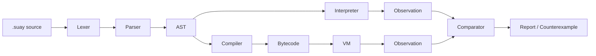

# One-page overview

## Artifact

SuayLang is a controlled experimental platform for studying explicit control-flow semantics (`dispatch`, `cycle`) and validating interpreter↔VM equivalence.

## Research question

Can interpreter and bytecode VM be kept observationally equivalent on a defined subset, with automatic validation that can produce counterexamples when false?

## Hypothesis (H2)

Interpreter and bytecode VM can be made observationally equivalent on a defined subset, and equivalence can be validated automatically.

## Methods

- Fixed conformance corpora
- Seeded differential fuzzing (raw JSONL logs)
- Coverage matrix linking constructs to corpora/fuzz/VM/interpreter/golden diagnostics

## Snapshot results

- Corpus total M=10 (baseline conformance + fixed tasks), divergences=0
- Fuzz seed=0, N=1000, divergences=0
- Subset construct categories X=14

## Diagram (component view)

## Where to go next

- Reviewer path: [docs/reviewer/REVIEWER_PATH.md](REVIEWER_PATH.md)
- Research core: [docs/research/RESEARCH_CORE.md](../research/RESEARCH_CORE.md)
- Paper kit: [docs/paper/suaylang_paper.md](../paper/suaylang_paper.md)
