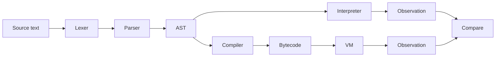

# One-page overview

## What is this?

SuayLang is a small, expression-oriented language used here as a controlled experimental platform to validate interpreter↔VM equivalence (H2) and to explore explicit control-flow design (`dispatch`, `cycle`).

## Claim (H2)

Interpreter and bytecode VM can be made observationally equivalent on a defined subset, and equivalence can be validated automatically.

## How it is tested (evidence)

```sh
pytest -q
python tools/conformance/run.py conformance/corpus
python -m tools.conformance.fuzz --seed 0 --n 1000
python tools/research/h2_eval.py
```

## Snapshot numbers

- Conformance corpus: `M = 30`, divergences `= 0`
- Fuzz: seed `= 0`, `N = 1000`, divergences `= 0`
- Supported subset size: `X = 14` constructs

## Diagram (components)



## Where to read next

- Research core: [docs/research/RESEARCH_CORE.md](../research/RESEARCH_CORE.md)
- Paper kit: [docs/paper/suaylang_paper.md](../paper/suaylang_paper.md)
